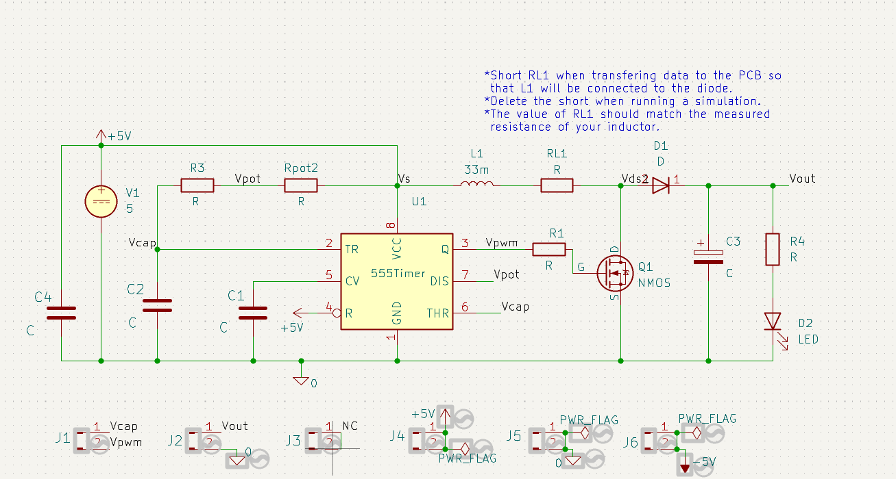
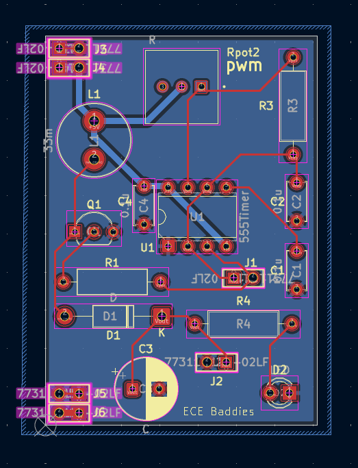
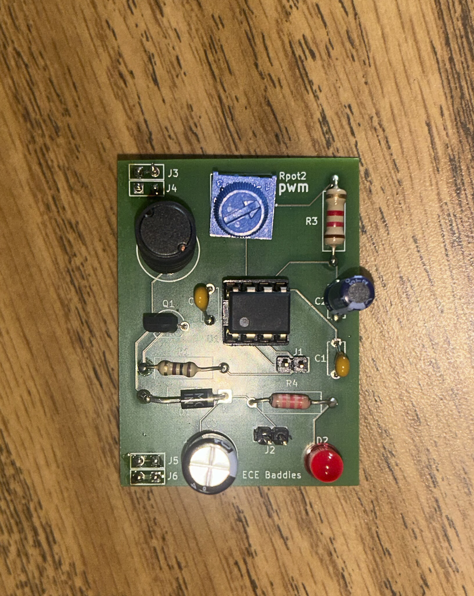

# Boost Converter

## Overview
Final project for **ECE 2300 Applied Circuits**. I worked in a group with my classmates and dear friends, Seth Gakwerere and Emily Wang, to design and build a boost converter that converts a 5 V input to a 12 V output.

The schematic and component footprints were provided by Professor Adam Barnes, while my teammates and I calculated the component values and analyzed the circuit. I volunteered to design the PCB layout that was ultimately used for our team's final circuit board.

## Features
- 5 V $\rightarrow$ 12 V boost conversion
- 555 timer-based switching control
- Adjustable duty cycle from approximately 50%-90%
- Custom PCB layout
- Through-hole component assembly
- PCB verified using KiCad's Electrical Rule Checker and Design Rule Checker

## Highlights
- First hands-on experience with PCB layout.
  - Learned about PCB design rules and manufacturing considerations.
  - Used [FreeDFM](https://www.my4pcb.com/net35/FreeDFMNet/FreeDFMHome.aspx) for the first time to verify Gerber files.
  - Used KiCad's ERC and DRC to identify and correct issues in the schematic and PCB.
- Calculated component values and analyzed the 555 timer's adjustable duty cycle required for the target output voltage.
  - Performed transient analysis through KiCad's simulations.
- Hands-on assembly and soldering of the final PCB in class.
  - Tested the completed PCB and verified its behavior.
- First collaborative electrical engineering project completed for a course.
  - Cooperation and communication throughout the entire project.
  - Divided circuit analysis, PCB design, assembly, and testing responsibilities.
  - All members worked together to write a technical report on the boost converter. The report included a deep-dive into design constraints, analysis, simulation, and experimental verification.

## Images

### Schematic

### PCB Layout

### Finished PCB

