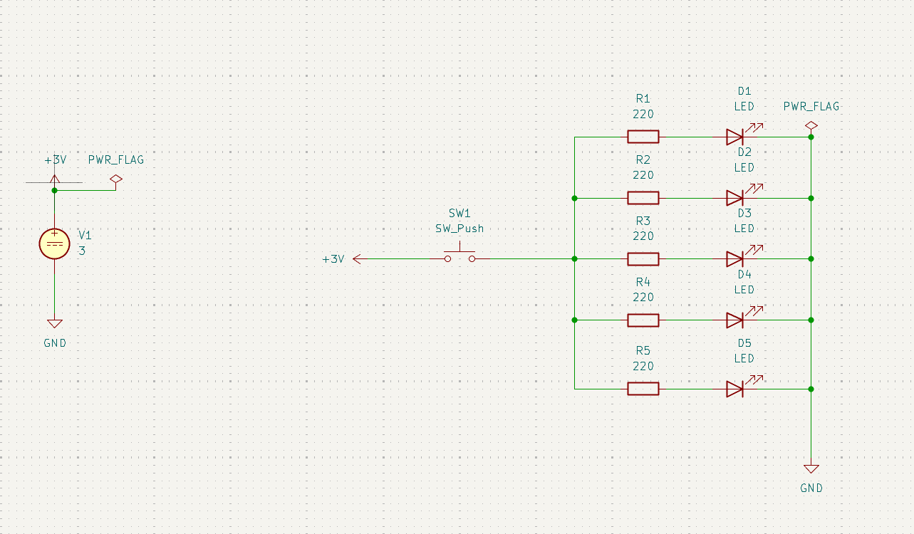
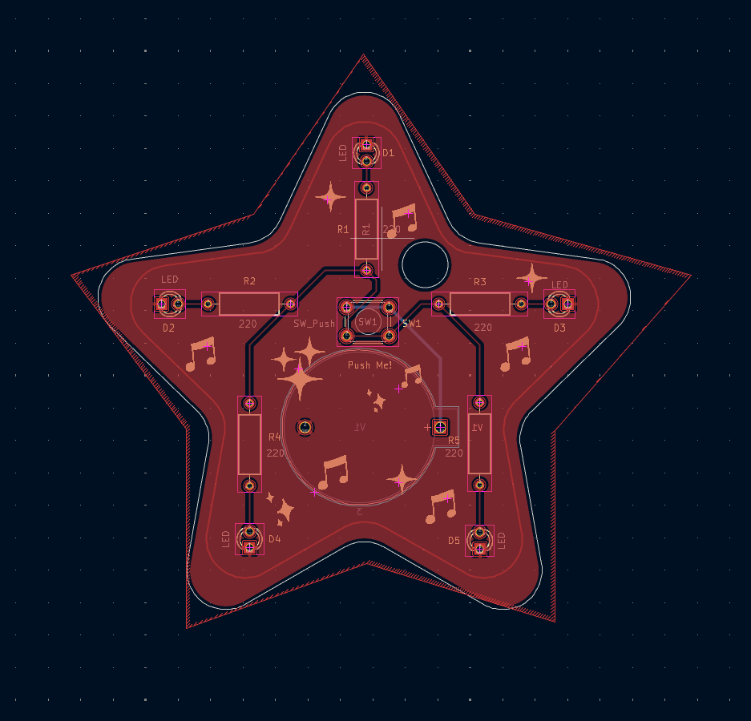
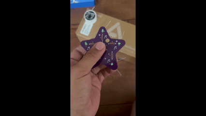

# Star Keychain PCB

## Overview
A custom star-shaped PCB keychain designed in KiCad as a gift for my younger sisters. This was my first independently designed PCB, taking the project from schematic drawing to PCB layout, manufacturing, soldering, and testing. I included the schematic, PCB, and a zip containing the Gerber files in their respective folders for reference.

## Features 
- Single-layer PCB designed in KiCad with a copper ground plane.
- 5 LEDs, each driven by its own 200 $\Omega$ current-limiting resistor.
- Powered by a CR2032 3 V coin cell.
- Pushbutton switch controls power to all LEDs.
- Estimated battery life of approximately 8-9 hours under continuous operation.

### Specifications
| Specification | Value |
| :------------ | :---: |
| Software      | KiCad |
| PCB Layers    | 1     |
| PCB Size      | ~ 3 x 3 in |
| Power Source  | CR2032 |
| LEDs          | 5     |
| Resistors     | 5 x 200 $\Omega$ |
| Manufacturing | JLCPCB |
| Components    | DigiKey |

## Highlights
- Designing a PCB from a schematic using KiCad.
- Learned PCB layout fundamentals including trace routing, copper pours, footprints, and design rule checking.
  - Creating and importing custom silkscreen artwork.
- Generating Gerber files and verifying manufacturability before fabrication via [FreeDFM](https://www.my4pcb.com/net35/FreeDFMNet/FreeDFMHome.aspx).
  - Encountered manufacturability check issues while validating the Gerber files using FreeDFM. After regenerating the Gerbers and verifying the export settings, the design passed all manufacturing checks.
- Ordered fabricated PCBs from [JLCPCB](https://jlcpcb.com/) and sourced components from [DigiKey](https://www.digikey.com/).

## Images

### Schematic

### PCB Layout

### Finished PCB
